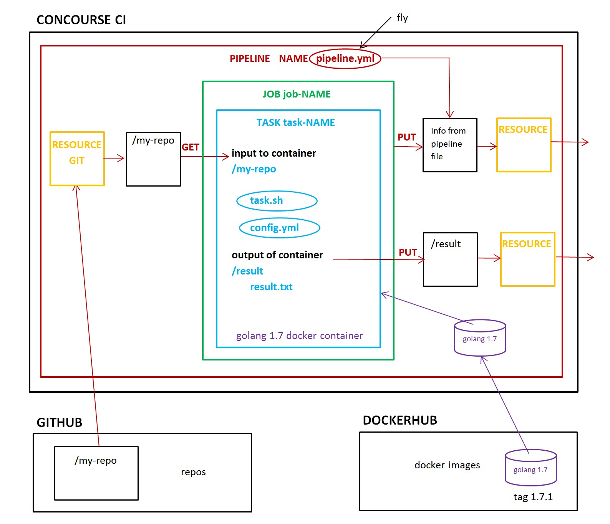

# CONCOURSE CI CHEAT SHEET

`concourse` _is a pipelined CI (Continuous Integration) for
Software Builds._

Concourse's main goal is to run tasks.

[GitHub Webpage](https://jeffdecola.github.io/my-cheat-sheets/)

[My Concourse task examples](https://jeffdecola.github.io/my-concourse-ci-tasks/)

There are a few ways to install concourse:

* Local VM with Vagrant (below)
* [Standalone Binary](https://github.com/JeffDeCola/my-cheat-sheets/blob/master/concourse-ci-cheat-sheet/install_concourse_binary_google_compute_engine.md)
* Docker Repository
* Clusters with BOSH
* Ansible Roles

## INSTALL CONCOURSE CI ON VIRTUALBOX USING VAGRANT

Get vargrant for windows

https://www.vagrantup.com

Get the Concourse Vagrant files. 

To run, from Windows cmd prompt type,

```bash
vagrant up
```

To upgrade (will destroy current pipelines).

```bash
vagrant box update --box concourse/lite     # gets the newest Vagrant box
vagrant destroy                             # remove the old Vagrant box
vagrant up 
```

Reinstal the new fly.exe for Windows and Linux.

## INSTALL CONCOURSE CI BINARY ON GOOGLE COMPUTE ENGINE

This is a little more involved and the directions are
[here](https://github.com/JeffDeCola/my-cheat-sheets/blob/master/concourse-ci-cheat-sheet/install_concourse_binary_google_compute_engine.md).

## INSTALL FLY ON WINDOWS

Open concourse,

http://192.168.100.4:8080/

In bottom right download latest verions of fly.exe for Linux,

Place in,

```bash
C:\Program Files (x86)\Concourse\fly.exe
```

Login fly to Concourse,

```bash
"C:\Program Files (x86)\Concourse\fly.exe" -t ci login -c http://192.168.100.4:8080/
```

Check version,

```bash
"C:\Program Files (x86)\Concourse\fly.exe" -version
```

## INSTALL FLY ON LINUX

Open Concourse,

http://192.168.100.4:8080/

In bottom right download latest verions of fly.exe for Linux,

Place in,

```bash
mkdir $HOME/bin
install $HOME/Downloads/fly $HOME/bin
```

Login fly to Concourse,

```bash
fly -t ci login -c http:// 192.168.100.4:8080/
```

Check version,

```bash
fly -version
```

## BASIC STRUCTURE OF CONCOURSE CI

See a more detailed example at
[my-concourse-ci-tasks](https://jeffdecola.github.io/my-concourse-ci-tasks/).

The following diagram illustrates compase running a task called seach-and-replace.

* `pipeline.yml` A pipeline of resources and jobs.
* `config.yml` Configures task
    * Grabs docker image
    * Sets up inputs/outputs into task container
* `task.sh` does the task

`IMPORTANT - THE JOBS ARE COMPLETELY IDENPENDENT OF EACH OTHER`

If you want to store 'state', use a resource to send it offsite.



## LOAD PIPELINE TO CONCOURSE CI

First login,

```bash
fly -t ci login
```

Then upload file,

```bash
fly -t ci set-pipeline -p NAME -c pipeline.yml --load-vars-from .credentials.yml
```

To remove pipeline,

```bash
fly -t ci destroy-pipeline --pipeline NAME
```

## CREATE A NEW TEAM

Create a new team,

```bash
fly -t ci set-team --team-name ciusers \
    --basic-auth-username admin \
    --basic-auth-password admin
```

Login to new team,

```bash
fly -t ci login -n ciusers -c http://<ip>:8080
```

Show all targets,

```bash
fly targets
```

Show all teams,

```bash
fly -t ci teams
```

## PASSING SECRETS TO USE IN YOUR SCRIPT (via env)

To pass secrets to your concourse script, first use fly to upload
the secret to concourse,

```bash
fly -t ci set-pipeline -p NAME -c pipeline.yml --load-vars-from .credentials.yml --var "private-key=$(cat private-key.txt)"
```

Then update the task in your pipeline to add params,

```yml
- task: mybuild
  file: task.yml
  params:
    PRIVATE_KEY: {{private-key}}
```

Then in you `task.yml` file, also use params with the same name,
it will be overwritten.

```yml
params:
  PRIVITE_KEY: "this will be overwritten"
```

Hence, this will create an env variable `PRIVATE_KEY` you
may use in your script.
